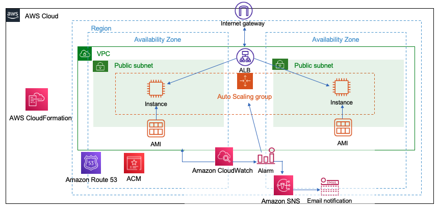

# AWS Auto Scaling Web Environment with CloudFormation

## About

This project demonstrates the use of AWS CloudFormation to create a secure, scalable, and monitored web application environment. The environment consists of the following components:

- 2 public subnets in different availability zones
- an EC2 instance in each public subnet running an Apache web server
- an Application Load Balancer (ALB) with the EC2 instances as targets
- a CloudWatch alarm that triggers an email notification when the CPU utilization of the EC2 instances exceeds 70%
- an Auto Scaling group that scales the EC2 instances out when the CPU utilization exceeds 70% and scales them in when the CPU utilization falls below 20%

## Skills/Tools

- AWS CloudFormation
- Application Load Balancer
- Auto Scaling Group
- Amazon Certification Manager
- Amazon CloudWatch
- Amazon Simple Notification Service
- Amazon Machine Image
- Internet Gateway

## Requirements & Specifications

- the environment must be created using AWS CloudFormation.
- the web application must be accessible via a secure HTTPS connection.
- the web application must be able to handle increased traffic by automatically scaling out the EC2 instances.
- the environment must be monitored and alerts must be sent to the team when any issues occur.

## Diagram

The below is a diagram of this project

## Instruction

The thorough instruction is [here](Auto-Scaling-Web-Environment-with-CloudFormation/docs/AWS-Auto-Scaling-Web-Environment-with-CloudFormation.pdf).

## Closing

### Personal Reflections

Of all the hands-on projects and exercises I've completed, this one holds a special place in my heart due to my passion for automation. This project fueled my desire to master automation services, and the process of building a self-scaling, self-monitoring infrastructure from CloudFormation templates was a significant milestone in my learning journey.

### Future Aspirations

This project reinforced my interest in streamlining operations and optimizing resource allocation.  I'm eager to continue exploring the world of automation, seeking ways to reduce manual tasks and improve efficiency within the cloud environment.

**Thank you for reading!**

