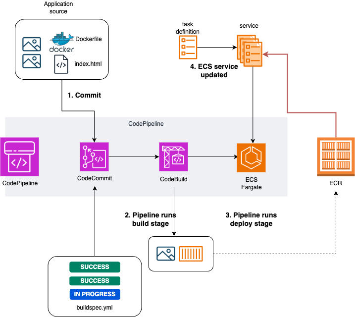

# CodePipeline

## About

This project demonstrates the use of full AWS CodePipeline incorporating commit, build, and deploy steps. 
Note: images of treadmill are generated by Google Gemini. 

## Skills/Tools

- AWS CodePipeline
- AWS CodeCommit
- AWS CodeBuild
- AWS Elastic Container Service (ECS) Fargate
- AWS Elastic Container Registry (ECR)
- AWS Application Load Balancer
- Docker

## Requirements & Specifications

None

## Diagram

The below are diagrams of this project.

## Instruction

The instruction is [here](./docs/AWS-CodePipeline.pdf).
Please note that my target audience is those who already have had used AWS and know how to navigate themselves on AWS Console or those who have Solution Architect Associate level of understanding in AWS. 

## Closing

### Personal Reflections

This marks my second mini project on AWS. Currently, I'm assisting my clients' DevOps team and heavily involved in CI/CD processes. Although our team doesn't utilize AWS for our projects, I was intrigued by the idea of conducting similar projects on AWS. This curiosity led me to undertake this mini project using CodePipeline. It turned out to be an enjoyable experience despite encountering some technical challenges.

During this project, I faced difficulties with nginx, VPC, and ALB target setup. Specifically, I encountered issues with nginx where images failed to appear on the browser while testing Docker images and ALB. Setting up VPC and ALB was an enlightening experience as it made me realize my weaknesses in networking.

### Future Aspirations

In the future, I aim to enhance my skills and deepen my knowledge of networking, particularly focusing on application-related aspects. I plan to engage in more hands-on activities involving networking within the AWS environment, allowing me to gain practical experience and proficiency. Furthermore, I aspire to dedicate more time to practicing with essential AWS services such as Elastic Load Balancers, VPC, EC2 instances, Security Groups, and others. This continuous learning and practical application will contribute to my growth and proficiency in AWS networking.

**Thank you for reading!**

